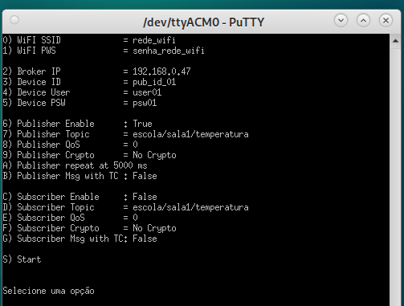
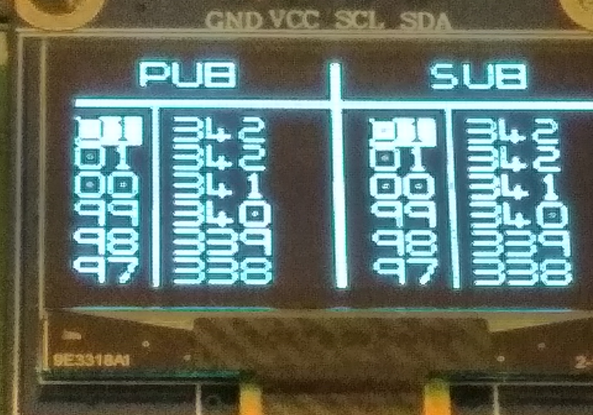
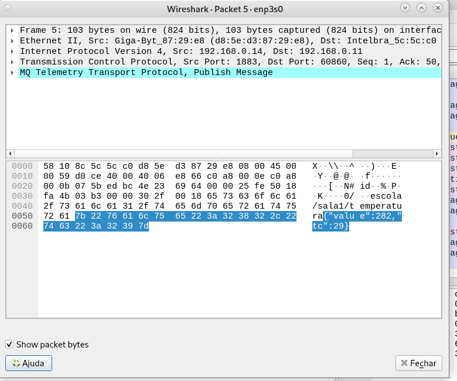
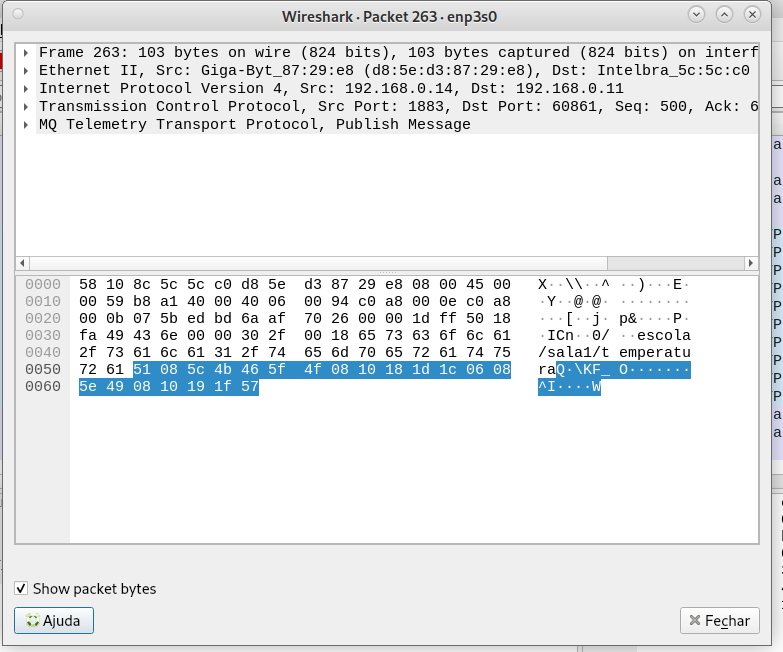

# Tarefa: IoT Security Lab - EmbarcaTech 2025

Autor: **Guilherme Alves dos Santos** e **Ricardo Jorge Furlan**

Curso: Residência Tecnológica em Sistemas Embarcados

Instituição: EmbarcaTech - HBr

Campinas 04, junho de 2025.

---

## ⚠ Disclaimer
## THE SOFTWARE IS PROVIDED "AS IS", USE AT YOUR OWN RISK
## O SOFTWARE É FORNECIDO "COMO ESTÁ", USE POR SUA CONTA E RISCO

## This code was developed for educational purposes as an assignment for Phase 2 of the residency program in the **EmbarcaTech professional training program**, with the goal of demonstrating some of the concepts learned during the residency.

## Third-Party Code

- The files for controlling the **OLED display** (`ssd1306_...` files) located in the `libs_ext` directory, including the text fonts, were based on the repository:  
  https://github.com/BitDogLab/BitDogLab-C/tree/main/display_oled_logo/inc with minor modifications.
- The `pico_sdk_import.cmake` file was **automatically generated** during project creation by the **Raspberry Pi Pico plugin**.
- The `CMakeLists.txt` file was initially **automatically generated** during project creation by the **Raspberry Pi Pico plugin**, and later edited as needed for the project.

## How to Build/Compile the Code

This software was developed for the **BitDogLab V6.3** board. This board uses the **Raspberry Pi Pico-W** board (which contains the **RP2040 microcontroller**).

For development, the **Visual Studio Code IDE** was used along with the **Raspberry Pi Pico plugin**. The SDK version used was **2.1.1**.

---

## Projeto de Configuração via Terminal TTY

Este projeto foi desenvolvido para ser utilizado por meio de um terminal TTY. Toda a configuração do sistema é feita diretamente pelo terminal, incluindo:

- Nome da rede Wi-Fi  
- Senha da rede Wi-Fi  
- Endereço IP do broker MQTT  
- Definição se o aplicativo atuará como **publisher** ou **subscriber**  
- e outras configurações

> **Recomendação:** Utilize o terminal **pytty** para melhor compatibilidade.

Abaixo, segue uma imagem ilustrativa da interface do terminal:

---

### Instruções de Uso

- Para **editar um item**, pressione o **primeiro caractere** da linha correspondente.
- Para **iniciar o aplicativo**, pressione a tecla **`S`**.
- > **Observação:** Durante a execução do programa, se **qualquer tecla** for pressionada no terminal, o aplicativo será interrompido e retornará ao **menu inicial** para reconfiguração.

---

### Funcionamento do Programa

Durante a operação normal, o programa envia mensagens contendo um **valor** (ex: temperatura) e um **TimeTick** (quando aplicável), repetidamente, em intervalos regulares.

### Interações:

- Pressionar o **Botão A**:
  - Decrementa o valor da temperatura
  - Incrementa o TimeTick
  - Envia uma nova mensagem

- Pressionar o **Botão B**:
  - Incrementa o valor da temperatura
  - Incrementa o TimeTick
  - Envia uma nova mensagem

---
### Funcionamento do LED RGB

O LED RGB é utilizado para indicar visualmente o estado do sistema e a atividade de comunicação, por meio de piscadas com cores distintas, conforme descrito abaixo:

- LED Azul
    - Pisca uma vez quando o Wi-Fi está conectado.
    - Pisca duas vezes quando o Wi-Fi e o broker MQTT estão conectados.

- LED Verde
    - Pisca sempre que a placa envia uma mensagem (modo publisher).

- LED Vermelho
    - Pisca sempre que a placa recebe uma mensagem (modo subscriber).

### Visualização no Display

O display exibe:

- O **TimeTick**
- A **mensagem** (temperatura)

Se o **TimeTick** estiver "aceso", isso indica que o TimeTick foi repetido. Esse comportamento se aplica tanto ao modo **publisher** quanto ao **subscriber**.

### Erros no modo subscriber:

Se o subscriber estiver aguardando mensagens com TimeTick e uma mensagem incompatível for recebida, ela será reportada como **ERRO**, com o indicador aceso.

---

### Observação Técnica

Optou-se por utilizar **TimeTick** em vez de **TimeStamp**, pois o TimeTick é mais simples de ser simulado manualmente com o comando `mosquitto_pub`, facilitando a verificação de mecanismos de proteção contra **replay attacks**.

---

## Etapas da Atividade

### Etapa 1: Conectando a BitDogLab ao Wi-Fi

Foi implementado um loop que monitora e atualiza a conexão com a rede Wi-Fi.  
Caso a placa não esteja conectada (ou tenha perdido a conexão), é iniciado automaticamente o processo de reconexão, incluindo a reativação do hardware de Wi-Fi, se necessário.

---

### Etapa 2: Configuração básica do MQTT para IoT

A conexão com o broker MQTT só é estabelecida **após a conexão com a rede Wi-Fi** estar ativa.  
Se o Wi-Fi for desconectado, a conexão com o broker MQTT é automaticamente encerrada.  
Após a reconexão do Wi-Fi, uma nova tentativa de conexão com o broker é feita.

Se o modo **subscriber** estiver ativo, uma requisição de inscrição (subscribe) é realizada após o estabelecimento da conexão com o broker.

> **Nota:** O controle de conexão e desconexão MQTT é gerenciado por uma **máquina de estados**, que garante a ordem e o tempo correto entre as etapas dos processos.

---

### Etapa 3: Publicação MQTT sem segurança

A imagem abaixo mostra uma captura feita com o **Wireshark**, evidenciando uma transmissão contendo um valor e o `TimeTick` **sem criptografia**.  
Isso demonstra como é simples interceptar os dados transmitidos em um ambiente sem segurança.

---

### Etapa 4: Autenticação básica no Mosquitto

Foi configurado o uso de autenticação básica no broker **Mosquitto**, aumentando a segurança das conexões MQTT.

Mosquito rejeitando a conexão (usuário inválido)

Mosquito aceitando a conexão (usuário inválido)

---

### Etapa 5: Simulação de Criptografia Leve (XOR)

A imagem abaixo mostra uma nova captura no **Wireshark**, agora com os dados criptografados utilizando uma operação **XOR simples** sobre o valor e o `TimeTick`.  
Mesmo sendo uma forma básica de criptografia, ela dificulta a leitura direta dos dados transmitidos, mostrando um primeiro passo em direção à proteção contra interceptações.

---
## Etapa 6: Proteção contra replay  
A proteção contra ataques de replay foi implementada por meio da inclusão de um campo TimeTick nas mensagens transmitidas.

A cada nova mensagem enviada, o TimeTick é incrementado.
No momento do recebimento, o valor do TimeTick é comparado com o último valor recebido:

- Se o novo TimeTick for maior, a mensagem é considerada válida.
- Se for igual ou menor, a mensagem é tratada como repetida (replay), e o sistema a rejeita ou a sinaliza como inválida.

Obs.: No display quando ocorre o replay o TimeTick fica "Acesso"

---

## 📜 Licença
GNU GPL-3.0.
